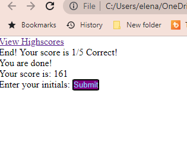

# 04 Web APIs: Code Quiz

This is a quiz application using HTML, CSS, and Javascript.  Timed quiz with 5 questions that the user has 4 multiple choice answers to choose from.  The score the user receives is the final time remaining at the time if answering the last questions, however every wrong answer deducts 10 seconds from the timer. The game also records the users score withing a high score page that will retain the collection of local high scores until cleared.
Once click the button start Quiz, quiz will begin, Once User Answers all the questions, quiz will be anded.
PS: Once choice made if incorrect answer, correct one will show up under the choices.

## Screenshot

## URL of deployed application

URL :  [Deployed Application](https://enemirovskaya.github.io/Coding-quiz-challenge/) of Coding-Quiz-Challenge

